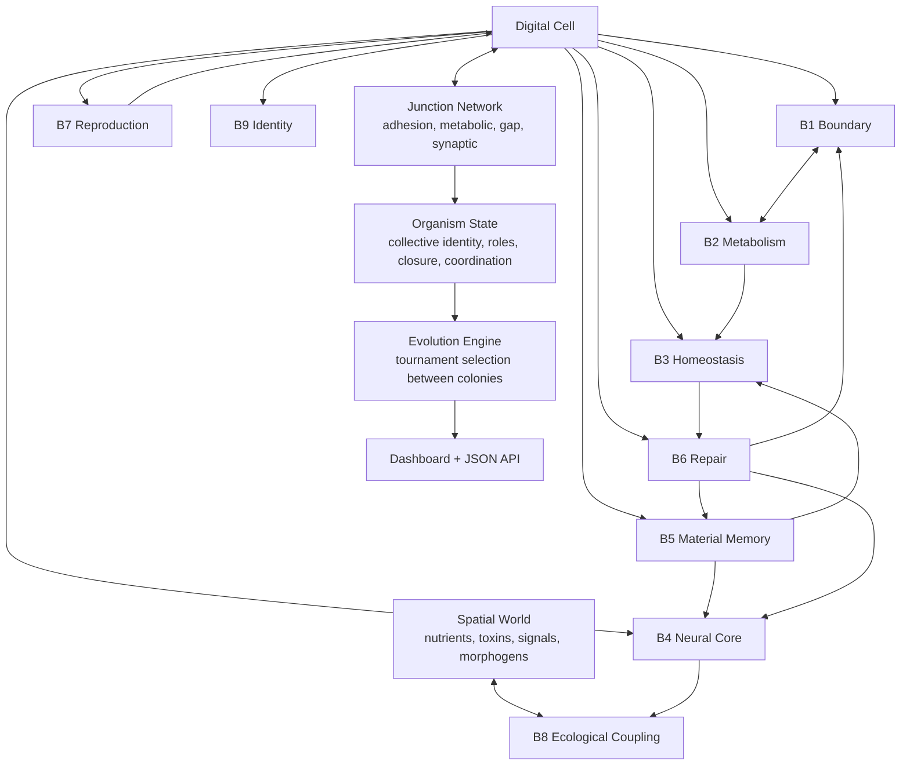

# nx-1 1.0

**CNDV — Celula Neuronal Digital Viva**

nx-1 1.0 is an artificial-life simulation engine where digital cells do more than move around a grid. Each cell carries metabolism, membrane integrity, homeostatic regulation, recurrent neural dynamics, material memory, repair, reproduction, intercellular communication, and identity. Colonies compete through a tournament-based evolutionary layer, while cells can bind into multicellular organisms with adhesion, metabolic exchange, synaptic signaling, role differentiation, policing, and organism-level reproduction pressure.

This is not a toy cellular automaton. It is a compact research-grade prototype for studying how autonomy, cooperation, degradation, repair, memory, communication, reproduction, and selection can be modeled together in one executable digital ecosystem.


## Why It Exists

Most artificial-life demos focus on one dimension: movement, reproduction, neural control, evolution, or visualization. nx-1 1.0 is built around a stricter question:

**What has to be present before a group of digital cells can begin to behave like a cooperative organism rather than a pile of independent agents?**

The simulation models that question through nine interacting biological abstractions:

| Block | System | Purpose |
| --- | --- | --- |
| B1 | Active boundary | Dynamic membrane integrity, permeability, structural damage, repair cost |
| B2 | Metabolism | Resource intake, ATP production, waste, material stores, metabolic efficiency |
| B3 | Homeostasis | Regulatory priorities computed from internal error signals |
| B4 | Neural substrate | Recurrent neural core, prediction error, excitation, plasticity, degradation |
| B5 | Material memory | Structural, regulatory, adaptive, and heritable memory traces |
| B6 | Repair | Competes with reproduction and repairs boundary, neural, memory, and metabolism |
| B7 | Reproduction | Maturity, risk, heredity, development process, failure modes |
| B8 | Ecological coupling | Spatial world, gradients, nutrients, toxins, signals, movement |
| B9 | Identity | Computed viability and organizational identity, including organizational death |

## What Makes It Valuable

- **Integrated artificial-life architecture**: metabolism, cognition, repair, memory, reproduction, death, communication, multicellularity, and evolution all interact in one model.
- **Emergent multicellularity**: cells form adhesion, metabolic, gap, and synaptic junctions; connected components are interpreted as organism candidates.
- **Organism-level metrics**: collective identity, boundary closure, role coverage, metabolic exchange, neural coordination, shared stress, and reproduction pressure.
- **Evolutionary selection layer**: multiple colonies compete in tournaments; weak colonies are reseeded from fitter lineages.
- **Dashboard included**: built-in HTTP dashboard visualizes cells, colonies, organisms, junctions, identity, fitness, and world state.
- **Local API included**: `/status`, `/world`, and `/evolution` expose simulation state as JSON.
- **Fully tested current surface**: pytest suite currently reports 100% line coverage.
- **Single-file executable core**: easy to inspect, run, package, refactor, or embed.

## Live Dashboard

Run the simulator:

```bash
python3 nx-1.py
```

Then open:

```text
http://localhost:8765
```

The dashboard shows:

- Current best colony
- Living cells and death log
- Cell phase, generation, type, identity, ATP, membrane, damage, neural excitation, memory, reproduction state, and communication state
- Multicellular organism metrics
- Junction network overlays
- Tournament fitness across colonies
- Nutrient and toxin fields

## Quick Start

### 1. Install Runtime Dependencies

```bash
python3 -m pip install numpy
```

### 2. Run a Small Simulation

```bash
python3 nx-1.py --max-cells 512 --n-colonies 4 --tournament-interval 500 --port 8765 --seed 42
```

### 3. Open the Dashboard

```text
http://localhost:8765
```

### 4. Query the API

```bash
curl http://localhost:8765/status
curl http://localhost:8765/world
curl http://localhost:8765/evolution
```

## Command-Line Options

```bash
python3 nx-1.py \
  --max-cells 10000 \
  --n-colonies 16 \
  --tournament-interval 2000 \
  --port 8765 \
  --seed 42
```

| Option | Default | Meaning |
| --- | ---: | --- |
| `--max-cells` | `10000` | Total cell budget across all colonies |
| `--n-colonies` | `16` | Number of parallel colonies in the evolutionary engine |
| `--tournament-interval` | `2000` | Ticks between selection events |
| `--port` | `8765` | Local HTTP dashboard/API port |
| `--seed` | `42` | Random seed for reproducible runs |

## Architecture



## Core Concepts

### Cells Are Not Static Particles

Each cell has internal state:

- ATP, raw resources, structural mass, repair material, reproductive material, waste
- Membrane integrity, permeability, maintenance cost, permanent damage
- Regulatory priorities for maintenance, repair, action, and reproduction
- Neural excitation, prediction error, adaptive trace, recurrent weights
- Material memory with heritable traces
- Damage, stress, death cause, generation, phase, type commitment

### Communication Is Costly and Situated

Cells emit and receive local biosemiotic signal fields:

- `nutrient_beacon`
- `toxin_alarm`
- `energy_need`
- `repair_need`
- `reproduction_ready`
- `crowding`
- `death_trace`

These are spatial, degradable, and tied to internal viability instead of arbitrary messages.

### Organisms Are Derived, Not Declared

The simulation does not simply label a group as an organism. It derives organism candidates from connected multicellular components and scores them by:

- Collective identity
- Boundary closure
- Role coverage
- Topology integrity
- Metabolic exchange
- Neural coordination
- Collective damage
- Shared stress
- Reproduction pressure

Development stages include:

- `solitary`
- `aggregate`
- `proto_tissue`
- `integrated`
- `integrated_body`
- `extinct`

### Evolution Operates Across Colonies

The `EvolutionEngine` runs multiple colonies and periodically ranks them by fitness. Lower-performing colonies are reseeded using mutated genomes from stronger colonies. This creates selection pressure above the individual-cell level.

## API

### `GET /status`

Returns the current best colony:

- Tick
- Alive count
- Phase distribution
- Generation distribution
- Cell type distribution
- Average identity
- Organism metrics
- Junction summaries
- Recent deaths
- Cell-level state

### `GET /world`

Returns spatial state:

- World dimensions
- Nutrient grid
- Toxin grid
- Source locations

### `GET /evolution`

Returns evolutionary state:

- Tournament count
- Colony fitness values
- Best colony index
- Colony sizes
- Colony development stages
- Founder genome fidelity
- Recent tournament history

## Testing

Install test dependencies:

```bash
python3 -m pip install pytest pytest-cov
```

Run the full suite:

```bash
python3 -m pytest -q
```

Run coverage and generate the HTML report:

```bash
python3 -m pytest --cov=. --cov-report html -q
```

Current verified result:

```text
39 passed
nx-1.py           100%
tests/test_nx1.py 100%
TOTAL              100%
```

Open the coverage report:

```text
htmlcov/index.html
```

## Use Cases

nx-1 1.0 is suitable for:

- Artificial-life research prototypes
- Emergence and cooperation experiments
- Digital organism demos
- Evolutionary simulation products
- Computational biology education
- Agent-based modeling exploration
- Interactive scientific visualization
- Investor or lab demos around synthetic digital life concepts

## Commercial Potential

This repository can be packaged into several product directions:

- **Research platform**: expose configuration files, experiment runs, metrics export, and batch simulation.
- **Visualization product**: turn the dashboard into a polished scientific interface for artificial-life demos.
- **Educational simulator**: create guided lessons around metabolism, homeostasis, reproduction, selection, and multicellularity.
- **API engine**: serve simulation state to external tools, notebooks, or front-end visualizers.
- **Generative ecosystem sandbox**: let users define selection pressures and watch colonies adapt.

The strongest selling point is not that it claims to be biological life. The strongest selling point is that it makes the missing pieces of digital life explicit and executable: boundary, metabolism, regulation, cognition, memory, repair, reproduction, communication, identity, cooperation, and selection.

## What This Is Not

To keep the project credible:

- It is not proof that the simulated cells are literally alive.
- It is not a validated biological model.
- It is not optimized yet for very large sparse worlds.
- It does not currently include a packaging layer, config files, database persistence, or experiment runner.

Those are productization opportunities, not hidden facts.

## Repository Layout

```text
.
├── nx-1.py              # Simulation engine, dashboard, local API, CLI
├── tests/
│   └── test_nx1.py      # Pytest suite with full current line coverage
├── htmlcov/              # Generated coverage report, ignored by git
├── .coverage             # Generated coverage database, ignored by git
└── .gitignore
```

## Recommended Next Product Steps

1. Add a real license and commercial terms.
2. Split the single file into modules: world, cell, organism, evolution, dashboard, API.
3. Add `requirements.txt` or `pyproject.toml`.
4. Add experiment configuration files.
5. Persist run metrics to JSONL, SQLite, or Parquet.
6. Add benchmark profiles for small, medium, and large simulations.
7. Add reproducible demo scenarios with fixed seeds.
8. Replace the embedded dashboard with a richer front end if the goal is commercial presentation.

## License

No license file is currently included. Add an explicit license before public distribution, commercial sale, or third-party reuse.

